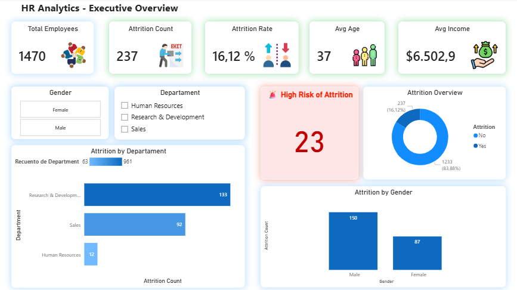
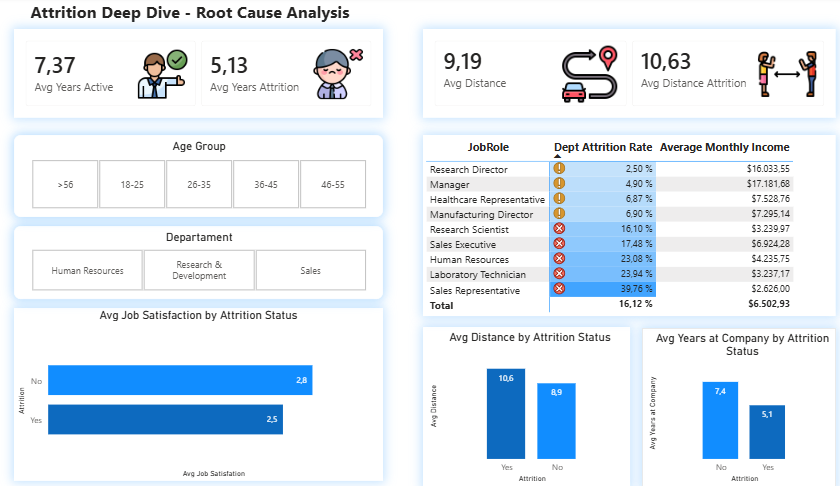
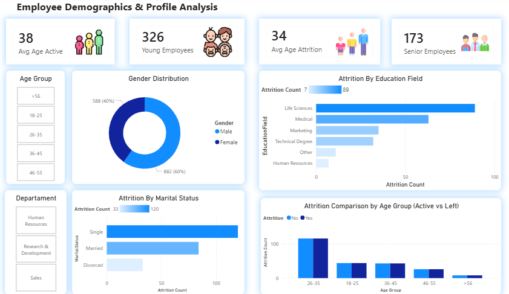

**📊 HR Analytics Dashboard - Employee Attrition Analysis**

# **🎯 Resumen Ejecutivo **
Dashboard interactivo de análisis de recursos humanos que identifica patrones de rotación de personal y factores de riesgo en una empresa con 1,470 empleados. El proyecto revela que el 16.12% de attrition está concentrado en perfiles específicos: empleados jóvenes, solteros, en roles de ventas, y con baja antigüedad.
---
**🚀 Problema de Negocio **
Una empresa enfrenta una tasa de rotación de personal del 16.12% (237 empleados renunciaron), significativamente por encima del estándar saludable de 5-10%. Se necesita identificar:

- ¿Qué departamentos y roles tienen mayor attrition? 
- ¿Qué factores predicen que un empleado renunciará? 
- ¿Cuál es el perfil de riesgo alto? 
- ¿Cómo se relacionan salarios, distancia y satisfacción con las renuncias?

**📊 Solución Implementada **
Dashboard interactivo de 3 páginas en Power BI que analiza:

**Página 1: Executive Overview**

KPIs principales: Total empleados, attrition count, attrition rate, edad promedio, salario promedio 
Distribución de attrition por departamento y género 
Tarjeta de alerta: 23 empleados en alto riesgo de renuncia

**Página 2: Attrition Deep Dive - Root Cause Analysis**

Análisis comparativo: años en la empresa, distancia de casa, satisfacción laboral 
Attrition por rol de trabajo (matriz con tasas y salarios) 
Identificación de roles críticos: Sales Representative (39.76% attrition) 

**Página 3: Employee Demographics & Profile Analysis**

Distribución demográfica: edad, género, estado civil, campo educativo 
Análisis generacional: empleados jóvenes vs senior 
Comparación de edad promedio: activos (38 años) vs renuncias (34 años)

**🔍 Insights Principales **
**📈 Hallazgos Críticos:**

**Roles de Alto Riesgo:**

- Sales Representative: 39.76% attrition (crítico) 
- Laboratory Technician: 23.94% attrition 
- Human Resources: 23.08% attrition

**Perfil de Riesgo:**

- **Edad:** 4 años más jóvenes (34 vs 38 años) 
- **Estado civil:** Solteros (120 renuncias - el grupo más alto) 
- **Antigüedad:** 2.24 años menos en la empresa (5.13 vs 7.37 años) 
- **Distancia:** Viven 1.44 km más lejos (10.63 vs 9.19 km)

**Brecha Salarial:**

- Empleados que renunciaron: $4,787/mes promedio 
- Empleados activos: $6,833/mes promedio 
- Gap: $2,046/mes - El salario bajo es un factor significativo

**Alto Riesgo Actual:**

- **23** empleados activos cumplen criterios de alto riesgo 
- **Criterios:** JobSatisfaction ≤ 2 + YearsAtCompany ≤ 2

**📊 Distribución:**

- **Research & Development:** 65.37% de empleados, 133 renuncias 
- **Sales:** 30.34% de empleados, 92 renuncias 
- **Human Resources:** 4.29% de empleados, 12 renuncias

**💡 Recomendaciones de Negocio**
**Acciones Inmediatas:**

**Intervención en Sales Representative:**

- Revisar estructura de compensación (están $1,400 bajo el promedio) 
- Implementar plan de retención para este rol 
- Análisis de carga de trabajo y expectativas

**Programa de Retención para Empleados Jóvenes:**

- Mentorías para empleados menores de 35 años 
- Plan de carrera claro en primeros 2 años 
- Revisión salarial para nuevos ingresos

**Revisión de Compensación:**

- Ajustar salarios del cuartil inferior 
- Bonus de retención para roles críticos 
- Benchmark contra mercado

**Seguimiento de Empleados de Alto Riesgo:**

- Entrevistas one-on-one con los 23 en riesgo 
- Plan de mejora de satisfacción laboral 
- Considerar trabajo remoto para empleados lejanos

**🛠️ Herramientas y Técnicas Utilizadas Power BI:**

- **Power Query:** Limpieza y transformación de datos 
- **DAX:** 20+ medidas calculadas (básicas, intermedias y avanzadas) 
- **Modelado de datos:** Tabla de hechos + dimensiones 
- **Visualizaciones:** 15+ visuales interactivos 
- Slicers sincronizados para interactividad

**Funciones DAX:**

- CALCULATE, FILTER, ALL 
- DIVIDE (manejo de errores) 
- TOPN (análisis de rankings) 
- Variables (VAR/RETURN) para código limpio 
- Time Intelligence (comparaciones temporales) 
- Formato condicional con medidas

**Diseño:**

- Paleta de colores consistente 
- Iconos en KPIs para mejor comprensión visual 
- Formato condicional (semáforos de riesgo) 
 -Tooltips informativos 
- Navegación intuitiva entre páginas

**📈 Habilidades Demostradas **
**✅ Análisis de Datos:**

- Identificación de patrones y correlaciones 
- Segmentación de datos (edad, departamento, rol) 
- Análisis comparativo (activos vs renuncias) 
- Identificación de outliers y grupos de riesgo

**✅ Power BI Técnico:**

- Limpieza de datos en Power Query 
- Creación de columnas calculadas (Age Groups) 
- 20+ medidas DAX con diferentes complejidades 
- Formato condicional dinámico 
- Interactividad con slicers

**✅ Business Intelligence:**

- Traducción de datos a insights accionables 
- Storytelling con datos (3 páginas con narrativa clara) 
- KPIs relevantes para stakeholders 
- Recomendaciones basadas en datos

**✅ Visualización:**

- Selección apropiada de gráficos por tipo de dato 
- Diseño limpio y profesional 
- Uso de colores para comunicar (rojo=problema, verde=ok) 
- Iconografía para facilitar comprensión

**📁 Dataset**
**Fuente:** IBM HR Analytics Employee Attrition Dataset (Kaggle) 

**Características:**
- 1,470 registros (empleados) 
- 35 columnas 

**Variables:** demográficas, laborales, satisfacción, compensación

**Transformaciones aplicadas:**

- Eliminación de columnas redundantes (Over18, EmployeeCount) 
- Creación de grupos de edad (5 categorías) 
- Validación de tipos de datos 
- Limpieza de valores nulos

**🎯 Resultados del Proyecto **
Impacto Potencial: 
**Si la empresa implementa las recomendaciones:**

- Reducción proyectada de attrition: de 16.12% a 10% (ahorro de ~60 renuncias/año) 
- Ahorro estimado en reclutamiento: $50K-$100K/año 
- Mejora en clima laboral y productividad

**Métricas de Éxito del Dashboard:**

- 3 páginas interactivas conectadas 
- 15+ visualizaciones complementarias 
- 20+ medidas DAX personalizadas 
- 6 slicers para exploración dinámica 
- Tiempo de carga: <2 segundos

**📸 Capturas de Pantalla **

**Dashboard 1: Executive Overview **

 
Vista general con KPIs principales y distribución de attrition

**Dashboard 2: Attrition Deep Dive**

 
Análisis de causas raíz y roles críticos

**Dashboard 3: Employee Demographics**

 
Perfil demográfico y análisis generacional

**🔗 Archivos del Proyecto**

- Dashboard interactivo: Descargar archivo .pbix 
- Dataset: HR_Analytics_Dataset.csv 
- GitHub: Repositorio completo

**👨‍💻 Sobre mí **
Diego Alejandro Pérez Pastrana 
Analista de Datos con experiencia en Power BI, SQL y análisis de negocio. 
📧 Email: devcode480@gmail.com 
💼 LinkedIn: linkedin.com/in/diego-perez480/ 
🐙 GitHub: github.com/AleCodeDev

**📝 Notas Técnicas **
- Versión de Power BI: Desktop (última versión) 
- Fecha de creación: Diciembre 2024 
- Tiempo de desarrollo: 3 días 
- Nivel del proyecto: Intermedio

Este proyecto fue desarrollado como parte de mi portafolio de análisis de datos, demostrando mis habilidades en Power BI, DAX, visualización de datos y business intelligence aplicado a recursos humanos.
